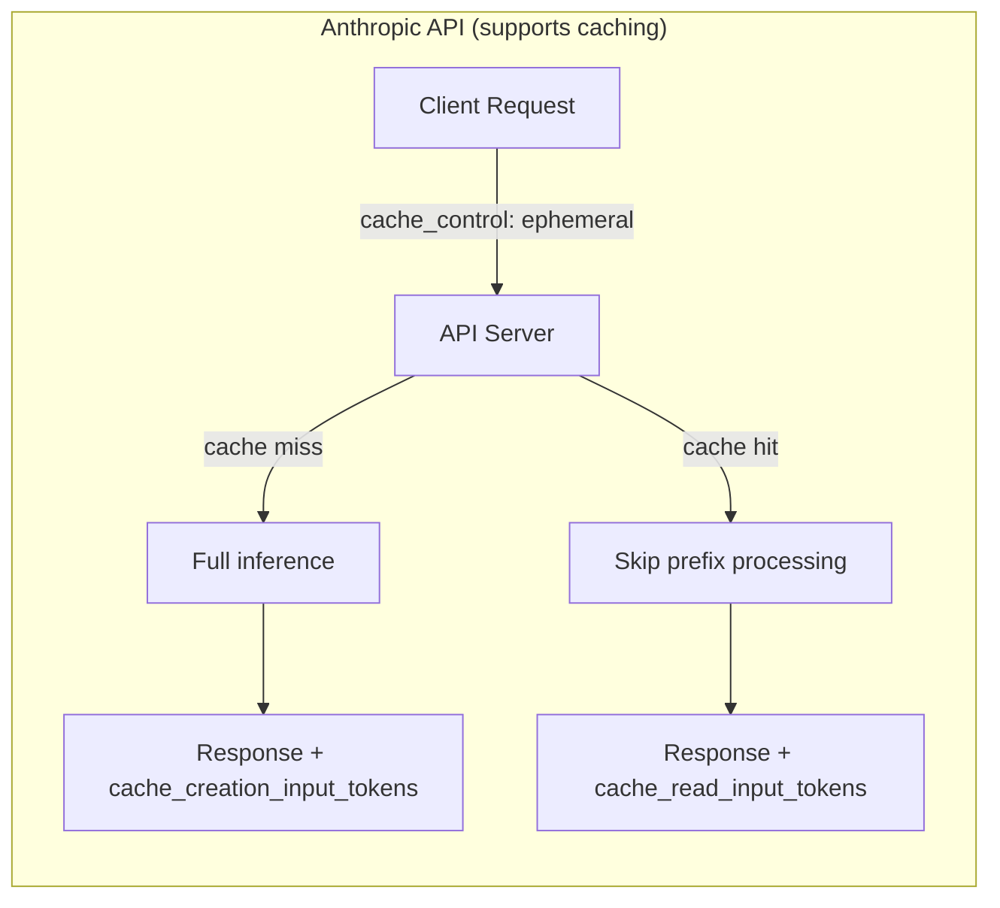
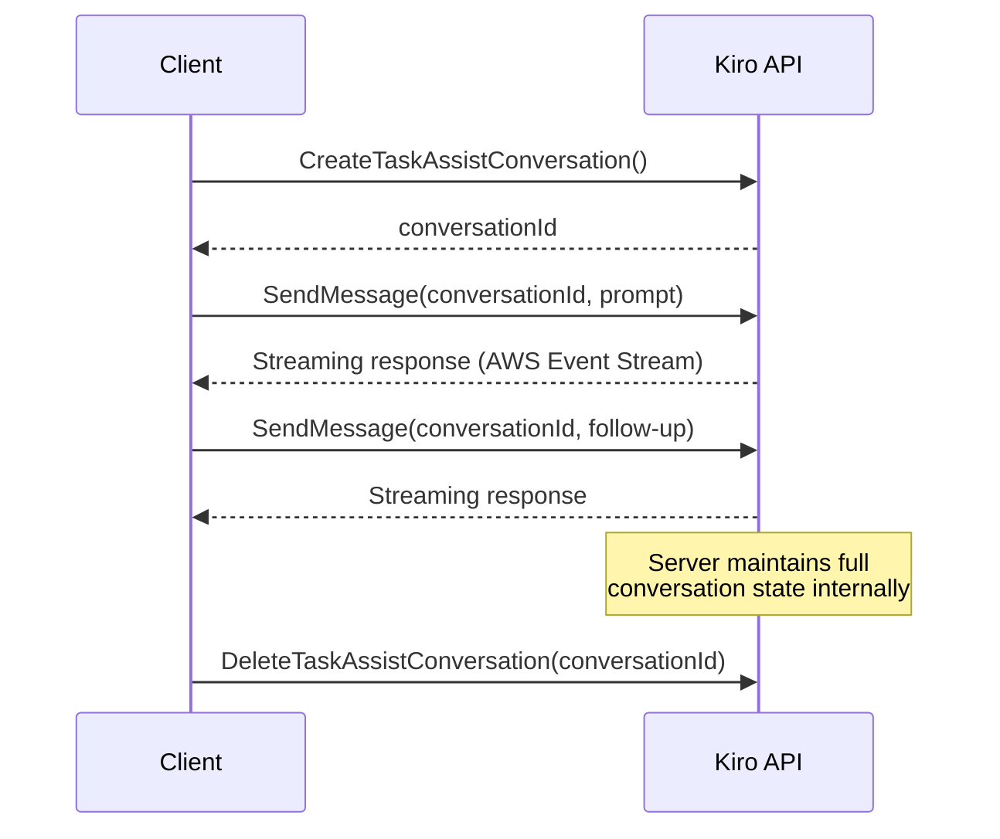
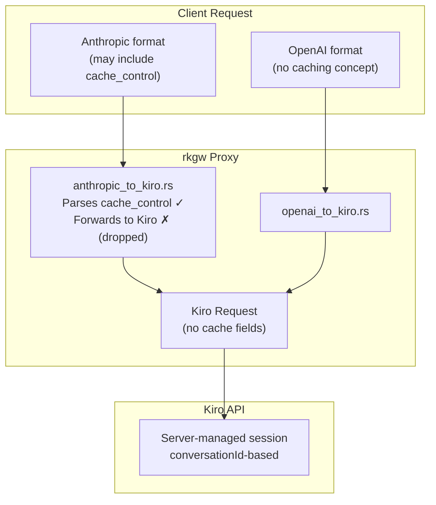

# Kiro/CodeWhisperer API — Prompt Caching Support

## Summary

The Kiro/CodeWhisperer API **does not support prompt caching**.

After reviewing the AWS Language Servers open-source codebase — including the CodeWhisperer service contracts, the Q Developer streaming client, the chat session management layer, and the agentic chat controller — there is no evidence of any prompt caching mechanism exposed to API consumers.

---

## Background: What Is Prompt Caching?

Prompt caching is a technique where portions of a conversation (typically the system prompt or early messages) are cached server-side so that repeated requests sharing the same prefix don't need to be re-processed. This reduces latency and cost.

Anthropic's API, for example, allows clients to annotate content blocks with `cache_control: {"type": "ephemeral"}` to hint that a block should be cached. On cache hit, the API returns `cache_creation_input_tokens` and `cache_read_input_tokens` in the usage response.

---

## How the Kiro API Handles Conversations Instead

The Kiro/CodeWhisperer API takes a fundamentally different approach. Rather than exposing a stateless messages API with client-side caching hints, it uses a **server-managed conversation session model**.

The server holds the entire conversation history behind the `conversationId`. The client never resends previous messages — it only sends the new user turn. This means:

- The server already has the full context and doesn't need to re-ingest it.
- There is no need for client-side cache hints because the server inherently avoids redundant processing.
- Any internal caching or optimization is opaque to the client.

---

## Evidence from the API Service Contracts

The CodeWhisperer API is defined in two service model files:

| Service Model | Auth Method | File |
|---|---|---|
| `bearer-token-service.json` | Bearer Token (OAuth2) | `src/client/token/bearer-token-service.json` |
| `service.json` | AWS SigV4 (IAM) | `src/client/sigv4/service.json` |

### Operations reviewed (Bearer Token)

| Operation | Purpose | Cache-related fields |
|---|---|---|
| `GenerateCompletions` | Inline code completion | None |
| `CreateTaskAssistConversation` | Start chat session | None |
| `SendMessage` (streaming) | Chat turn | None |
| `StartTaskAssistCodeGeneration` | Code generation | None |
| `StartCodeAnalysis` | Security scanning | None |

### Request/Response shapes reviewed

| Shape | Fields | Cache-related |
|---|---|---|
| `ConversationState` | `conversationId`, `currentMessage`, `chatTriggerType` | No |
| `UserInputMessage` | `content`, `userInputMessageContext` | No |
| `AssistantResponseMessage` | `content`, `toolUse` | No |
| `ChatMessage` | `role`, `content` | No |
| `FileContext` | `filename`, `content`, `programmingLanguage` | No |

No shape in either service definition contains `cache_control`, `cache_creation_input_tokens`, `cache_read_input_tokens`, or any similar field.

---

## Impact on the Proxy Gateway (`rkgw`)

The proxy gateway accepts requests in both OpenAI and Anthropic formats and converts them to Kiro format.

Specifically:

- `src/models/anthropic.rs` — The `cache_control` field is defined on the Anthropic content block model so incoming requests parse correctly.
- `src/converters/anthropic_to_kiro.rs` — During conversion, `cache_control` is **silently dropped** because the Kiro request format has no equivalent field.
- There is no way to forward prompt caching hints to the Kiro backend, and no usage response fields to relay cache hit/miss information back to the client.

---

## Conclusion

| Feature | Anthropic API | Kiro/CodeWhisperer API |
|---|---|---|
| Client-side cache hints | `cache_control: {"type": "ephemeral"}` | Not supported |
| Cache usage reporting | `cache_creation_input_tokens`, `cache_read_input_tokens` | Not available |
| Conversation model | Stateless (client resends full history) | Stateful (server holds history via `conversationId`) |
| Internal optimization | Client-directed caching | Opaque, server-managed |

The Kiro API's stateful conversation model means the server already avoids redundant context processing. Prompt caching as a client-facing feature is unnecessary in this architecture — and is not exposed.

---

## Sources

- [aws/language-servers — Overview (DeepWiki)](https://deepwiki.com/aws/language-servers/1-overview)
- [aws/language-servers — API Definitions & Service Contracts (DeepWiki)](https://deepwiki.com/aws/language-servers/5.2-api-definitions-and-service-contracts)
- [aws/language-servers — Chat System (DeepWiki)](https://deepwiki.com/aws/language-servers/3.1.2-chat-system)
- [aws/language-servers — Chat Controllers & Session Management (DeepWiki)](https://deepwiki.com/aws/language-servers/3.1.2.1-chat-controllers-and-session-management)
- [bearer-token-service.json (GitHub)](https://github.com/aws/language-servers/blob/5d2b3ecf/server/aws-lsp-codewhisperer/src/client/token/bearer-token-service.json)
- [service.json — SigV4 (GitHub)](https://github.com/aws/language-servers/blob/5d2b3ecf/server/aws-lsp-codewhisperer/src/client/sigv4/service.json)
